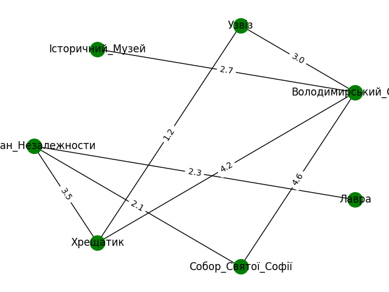

# goit-algo-hw-06

# Опис домашнього завдання

#### #Завдання 1

Створіть граф за допомогою бібліотеки networkX для моделювання певної реальної мережі (наприклад, транспортної мережі міста, соціальної мережі, інтернет-топології).

```INFO
📖 Реальну мережу можна вибрати на свій розсуд, якщо немає можливості придумати свою мережу, наближену до реальності.
```

Візуалізуйте створений граф, проведіть аналіз основних характеристик (наприклад, кількість вершин та ребер, ступінь вершин).

#### Завдання 2

Напишіть програму, яка використовує алгоритми DFS і BFS для знаходження шляхів у графі, який було розроблено у першому завданні.

Далі порівняйте результати виконання обох алгоритмів для цього графа, висвітлить різницю в отриманих шляхах. Поясніть, чому шляхи для алгоритмів саме такі.

#### Завдання 3

Реалізуйте алгоритм Дейкстри для знаходження найкоротшого шляху в розробленому графі: додайте у граф ваги до ребер та знайдіть найкоротший шлях між всіма вершинами графа.

# Київ

Модель обходу графа умовного представлення туристичного маршруту міста Київ за допомогою алгоритмів `ПОШУК У ГЛИБИНУ (DFS)` та  `ПОШУК У ШИРИНУ (BFS)`.



## ПОШУК У ГЛИБИНУ (DFS)

Алгоритм відвідує більш віддалені вершини від стартової точки, перш ніж повертатися (рекурсія).

### Логіка алгоритму:

1. Початок обходу з точки  🛡`"Історичний_Музей"`.
2. Переходимо до точки ⛪️`"Володимирський_Собор"`, так як це єдиний сусід точки 🛡`"Історичний_Музей"`.
3. Від точки ⛪️`"Володимирський_Собор"` алгоритм обиратиме наступні невідвідані точки і рухатиметься далі.
4. Алгоритм буде повторюватись до тих пір, доки не будуть відвідані всі доступні вершини.

## ПОШУК У ШИРИНУ (BFS)

Алгоритм відвідує всі сусідні вершини, перш ніж переходити на наступний рівень.

### Логіка алгоритму:

1. Початок обходу з точки  🛡 `"Історичний_Музей"`.
2. Переходимо до точки ⛪️ `"Володимирський_Собор"`, так як це єдиний сусід точки 🛡 `"Історичний_Музей"`.
3. Від точки ⛪️ `"Володимирський_Собор"` алгоритм обиратиме наступні невідвідані точки-СУСІДИ:
   1. 🚶 `Узвіз`
   2. 🏣 `Хрещатик`
   3. ⛪️ `Собор_Святої_Софії`
4. Він обійде спочатку їх, а потім рухатиметься далі.
5. Алгоритм продовжуватимеся з відвідуванням всіх сусідніх вершин на кожному рівні, перш ніж буде переходити до наступного рівня.
